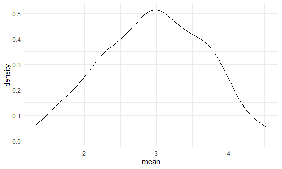
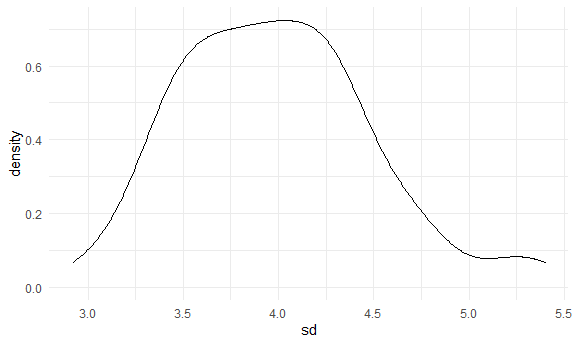

simulation
================
Chenxin Zhang
11/17/2020

simulation is do repeated sampling which cannot do in really life

# Let’s simulate something

creat a normal distribution data

``` r
sim_data = 
    tibble(
      x = rnorm(n = 100, mean = 2, sd = 3)
    )
```

summarize mean and sd

``` r
sim_data %>% 
    summarize(
      mean = mean(x),
      sd = sd(x)
    )
```

    ## # A tibble: 1 x 2
    ##    mean    sd
    ##   <dbl> <dbl>
    ## 1  2.33  2.69

Creat a function.

``` r
sim_mean_sd = function(samp_size, mu = 3, sigma = 4) {
  
  sim_data = 
    tibble(
      x = rnorm(n = samp_size, mean = mu, sd = sigma)
    )#generate data from a normal distribution
  sim_data %>% 
    summarize(
      mean = mean(x),
      sd = sd(x)
    )
  
}
```

I can “simulate” by running this line.

``` r
sim_mean_sd(30)
```

    ## # A tibble: 1 x 2
    ##    mean    sd
    ##   <dbl> <dbl>
    ## 1  3.30  2.96

## Let’s simulate a lot

**for loop**

``` r
output = vector("list", length = 100)#vector of type list
for (i in 1:100) {
  
  output[[i]] = sim_mean_sd(samp_size = 30)
  
}
bind_rows(output)#not a list but data frame
```

    ## # A tibble: 100 x 2
    ##     mean    sd
    ##    <dbl> <dbl>
    ##  1  1.35  4.13
    ##  2  4.04  4.03
    ##  3  3.51  4.24
    ##  4  2.08  4.17
    ##  5  3.23  4.30
    ##  6  3.98  3.66
    ##  7  3.21  3.44
    ##  8  2.71  4.52
    ##  9  3.16  3.82
    ## 10  3.04  4.08
    ## # ... with 90 more rows

Let’s use a loop function. similar to for loop

``` r
# rerun the function 100 times
sim_results = 
  rerun(100, sim_mean_sd(samp_size = 30)) %>% 
  bind_rows()
```

Let’s look at results…

``` r
sim_results %>% 
  ggplot(aes(x = mean)) + geom_density()
```



``` r
sim_results %>% 
  summarize(
    avg_samp_mean = mean(mean),
    sd_samp_mean = sd(mean)
  )
```

    ## # A tibble: 1 x 2
    ##   avg_samp_mean sd_samp_mean
    ##           <dbl>        <dbl>
    ## 1          2.95        0.708

``` r
sim_results %>% 
  ggplot(aes(x = sd)) + geom_density()
```



## Let’s try other sample sizes.

when n=30 run simulation code 100 times

``` r
n_list = 
  list(
    "n = 30" = 30,
    "n = 60" = 60,
    "n = 120" = 120,
    "n = 240" = 240
  )

output = vector("list", length = 4)
output[[1]] = rerun(100, sim_mean_sd(samp_size = n_list[[1]])) %>% bind_rows()#compute only one time, so we use for loop to simulate many times


for (i in 1:4) {
  output[[i]] = 
    rerun(100, sim_mean_sd(samp_size = n_list[[i]])) %>% 
    bind_rows()
}#finally get 4 list
```

``` r
# make a tibble and use mutate to add the result as new column
# maping  sample_size across return(), get a list column
# .x means that the first argument to map is .x; tidle means put the .x to the function; whatever the first sample size is , it is going to get plugged in over the function
sim_results = 
  tibble(
    sample_size = c(30, 60, 120, 240)
  ) %>% 
  mutate(
    output_lists = map(.x = sample_size, ~ rerun(100, sim_mean_sd(.x))))
```

``` r
#pull the list from column
#in the result : [[1]] means the first element in the output lists is a list, [[1]][[2]]] means the second piece in that list is a tibble
sim_results %>% 
  pull(output_lists)
```

    ## [[1]]
    ## [[1]][[1]]
    ## # A tibble: 1 x 2
    ##    mean    sd
    ##   <dbl> <dbl>
    ## 1  2.75  3.94
    ## 
    ## [[1]][[2]]
    ## # A tibble: 1 x 2
    ##    mean    sd
    ##   <dbl> <dbl>
    ## 1  2.52  4.32
    ## 
    ## [[1]][[3]]
    ## # A tibble: 1 x 2
    ##    mean    sd
    ##   <dbl> <dbl>
    ## 1  2.76  3.65
    ## 
    ## [[1]][[4]]
    ## # A tibble: 1 x 2
    ##    mean    sd
    ##   <dbl> <dbl>
    ## 1  2.14  3.12
    ## 
    ## [[1]][[5]]
    ## # A tibble: 1 x 2
    ##    mean    sd
    ##   <dbl> <dbl>
    ## 1  2.79  3.65
    ## 
    ## [[1]][[6]]
    ## # A tibble: 1 x 2
    ##    mean    sd
    ##   <dbl> <dbl>
    ## 1  3.73  4.25
    ## 
    ## [[1]][[7]]
    ## # A tibble: 1 x 2
    ##    mean    sd
    ##   <dbl> <dbl>
    ## 1  1.37  3.95
    ## 
    ## [[1]][[8]]
    ## # A tibble: 1 x 2
    ##    mean    sd
    ##   <dbl> <dbl>
    ## 1  3.48  4.25
    ## 
    ## [[1]][[9]]
    ## # A tibble: 1 x 2
    ##    mean    sd
    ##   <dbl> <dbl>
    ## 1  2.96  3.93
    ## 
    ## [[1]][[10]]
    ## # A tibble: 1 x 2
    ##    mean    sd
    ##   <dbl> <dbl>
    ## 1  2.76  3.72
    ## 
    ## [[1]][[11]]
    ## # A tibble: 1 x 2
    ##    mean    sd
    ##   <dbl> <dbl>
    ## 1  3.55  3.82
    ## 
    ## [[1]][[12]]
    ## # A tibble: 1 x 2
    ##    mean    sd
    ##   <dbl> <dbl>
    ## 1  3.75  4.13
    ## 
    ## [[1]][[13]]
    ## # A tibble: 1 x 2
    ##    mean    sd
    ##   <dbl> <dbl>
    ## 1  2.11  4.05
    ## 
    ## [[1]][[14]]
    ## # A tibble: 1 x 2
    ##    mean    sd
    ##   <dbl> <dbl>
    ## 1  3.04  4.71
    ## 
    ## [[1]][[15]]
    ## # A tibble: 1 x 2
    ##    mean    sd
    ##   <dbl> <dbl>
    ## 1  2.51  4.42
    ## 
    ## [[1]][[16]]
    ## # A tibble: 1 x 2
    ##    mean    sd
    ##   <dbl> <dbl>
    ## 1  3.83  4.45
    ## 
    ## [[1]][[17]]
    ## # A tibble: 1 x 2
    ##    mean    sd
    ##   <dbl> <dbl>
    ## 1  2.00  3.40
    ## 
    ## [[1]][[18]]
    ## # A tibble: 1 x 2
    ##    mean    sd
    ##   <dbl> <dbl>
    ## 1  2.37  4.63
    ## 
    ## [[1]][[19]]
    ## # A tibble: 1 x 2
    ##    mean    sd
    ##   <dbl> <dbl>
    ## 1  3.37  3.05
    ## 
    ## [[1]][[20]]
    ## # A tibble: 1 x 2
    ##    mean    sd
    ##   <dbl> <dbl>
    ## 1  2.70  5.40
    ## 
    ## [[1]][[21]]
    ## # A tibble: 1 x 2
    ##    mean    sd
    ##   <dbl> <dbl>
    ## 1  3.54  4.33
    ## 
    ## [[1]][[22]]
    ## # A tibble: 1 x 2
    ##    mean    sd
    ##   <dbl> <dbl>
    ## 1  3.29  3.95
    ## 
    ## [[1]][[23]]
    ## # A tibble: 1 x 2
    ##    mean    sd
    ##   <dbl> <dbl>
    ## 1  3.58  3.13
    ## 
    ## [[1]][[24]]
    ## # A tibble: 1 x 2
    ##    mean    sd
    ##   <dbl> <dbl>
    ## 1  2.41  4.59
    ## 
    ## [[1]][[25]]
    ## # A tibble: 1 x 2
    ##    mean    sd
    ##   <dbl> <dbl>
    ## 1  1.50  3.88
    ## 
    ## [[1]][[26]]
    ## # A tibble: 1 x 2
    ##    mean    sd
    ##   <dbl> <dbl>
    ## 1  2.83  3.17
    ## 
    ## [[1]][[27]]
    ## # A tibble: 1 x 2
    ##    mean    sd
    ##   <dbl> <dbl>
    ## 1  4.14  3.84
    ## 
    ## [[1]][[28]]
    ## # A tibble: 1 x 2
    ##    mean    sd
    ##   <dbl> <dbl>
    ## 1  3.09  4.52
    ## 
    ## [[1]][[29]]
    ## # A tibble: 1 x 2
    ##    mean    sd
    ##   <dbl> <dbl>
    ## 1  2.72  3.37
    ## 
    ## [[1]][[30]]
    ## # A tibble: 1 x 2
    ##    mean    sd
    ##   <dbl> <dbl>
    ## 1  4.08  4.01
    ## 
    ## [[1]][[31]]
    ## # A tibble: 1 x 2
    ##    mean    sd
    ##   <dbl> <dbl>
    ## 1  3.79  4.00
    ## 
    ## [[1]][[32]]
    ## # A tibble: 1 x 2
    ##    mean    sd
    ##   <dbl> <dbl>
    ## 1  2.31  4.19
    ## 
    ## [[1]][[33]]
    ## # A tibble: 1 x 2
    ##    mean    sd
    ##   <dbl> <dbl>
    ## 1  2.00  3.09
    ## 
    ## [[1]][[34]]
    ## # A tibble: 1 x 2
    ##    mean    sd
    ##   <dbl> <dbl>
    ## 1  2.64  3.61
    ## 
    ## [[1]][[35]]
    ## # A tibble: 1 x 2
    ##    mean    sd
    ##   <dbl> <dbl>
    ## 1  3.05  3.61
    ## 
    ## [[1]][[36]]
    ## # A tibble: 1 x 2
    ##    mean    sd
    ##   <dbl> <dbl>
    ## 1  3.10  3.82
    ## 
    ## [[1]][[37]]
    ## # A tibble: 1 x 2
    ##    mean    sd
    ##   <dbl> <dbl>
    ## 1  1.79  3.27
    ## 
    ## [[1]][[38]]
    ## # A tibble: 1 x 2
    ##    mean    sd
    ##   <dbl> <dbl>
    ## 1  3.67  3.58
    ## 
    ## [[1]][[39]]
    ## # A tibble: 1 x 2
    ##    mean    sd
    ##   <dbl> <dbl>
    ## 1  1.50  4.12
    ## 
    ## [[1]][[40]]
    ## # A tibble: 1 x 2
    ##    mean    sd
    ##   <dbl> <dbl>
    ## 1  2.86  3.18
    ## 
    ## [[1]][[41]]
    ## # A tibble: 1 x 2
    ##    mean    sd
    ##   <dbl> <dbl>
    ## 1  3.14  4.21
    ## 
    ## [[1]][[42]]
    ## # A tibble: 1 x 2
    ##    mean    sd
    ##   <dbl> <dbl>
    ## 1  3.31  3.71
    ## 
    ## [[1]][[43]]
    ## # A tibble: 1 x 2
    ##    mean    sd
    ##   <dbl> <dbl>
    ## 1  4.03  4.51
    ## 
    ## [[1]][[44]]
    ## # A tibble: 1 x 2
    ##    mean    sd
    ##   <dbl> <dbl>
    ## 1  2.20  3.87
    ## 
    ## [[1]][[45]]
    ## # A tibble: 1 x 2
    ##    mean    sd
    ##   <dbl> <dbl>
    ## 1  3.35  3.44
    ## 
    ## [[1]][[46]]
    ## # A tibble: 1 x 2
    ##    mean    sd
    ##   <dbl> <dbl>
    ## 1  2.39  4.22
    ## 
    ## [[1]][[47]]
    ## # A tibble: 1 x 2
    ##    mean    sd
    ##   <dbl> <dbl>
    ## 1  3.92  2.77
    ## 
    ## [[1]][[48]]
    ## # A tibble: 1 x 2
    ##    mean    sd
    ##   <dbl> <dbl>
    ## 1  2.39  3.11
    ## 
    ## [[1]][[49]]
    ## # A tibble: 1 x 2
    ##    mean    sd
    ##   <dbl> <dbl>
    ## 1  4.02  3.56
    ## 
    ## [[1]][[50]]
    ## # A tibble: 1 x 2
    ##    mean    sd
    ##   <dbl> <dbl>
    ## 1  4.36  3.57
    ## 
    ## [[1]][[51]]
    ## # A tibble: 1 x 2
    ##    mean    sd
    ##   <dbl> <dbl>
    ## 1  2.07  4.39
    ## 
    ## [[1]][[52]]
    ## # A tibble: 1 x 2
    ##    mean    sd
    ##   <dbl> <dbl>
    ## 1  2.93  3.81
    ## 
    ## [[1]][[53]]
    ## # A tibble: 1 x 2
    ##    mean    sd
    ##   <dbl> <dbl>
    ## 1  3.99  3.57
    ## 
    ## [[1]][[54]]
    ## # A tibble: 1 x 2
    ##    mean    sd
    ##   <dbl> <dbl>
    ## 1  2.05  4.09
    ## 
    ## [[1]][[55]]
    ## # A tibble: 1 x 2
    ##    mean    sd
    ##   <dbl> <dbl>
    ## 1  3.97  3.38
    ## 
    ## [[1]][[56]]
    ## # A tibble: 1 x 2
    ##    mean    sd
    ##   <dbl> <dbl>
    ## 1  2.33  4.14
    ## 
    ## [[1]][[57]]
    ## # A tibble: 1 x 2
    ##    mean    sd
    ##   <dbl> <dbl>
    ## 1  3.55  4.62
    ## 
    ## [[1]][[58]]
    ## # A tibble: 1 x 2
    ##    mean    sd
    ##   <dbl> <dbl>
    ## 1  2.31  4.15
    ## 
    ## [[1]][[59]]
    ## # A tibble: 1 x 2
    ##    mean    sd
    ##   <dbl> <dbl>
    ## 1  3.23  3.75
    ## 
    ## [[1]][[60]]
    ## # A tibble: 1 x 2
    ##    mean    sd
    ##   <dbl> <dbl>
    ## 1  3.14  3.81
    ## 
    ## [[1]][[61]]
    ## # A tibble: 1 x 2
    ##    mean    sd
    ##   <dbl> <dbl>
    ## 1  3.81  3.58
    ## 
    ## [[1]][[62]]
    ## # A tibble: 1 x 2
    ##    mean    sd
    ##   <dbl> <dbl>
    ## 1  1.70  4.13
    ## 
    ## [[1]][[63]]
    ## # A tibble: 1 x 2
    ##    mean    sd
    ##   <dbl> <dbl>
    ## 1  3.84  3.85
    ## 
    ## [[1]][[64]]
    ## # A tibble: 1 x 2
    ##    mean    sd
    ##   <dbl> <dbl>
    ## 1  3.00  3.45
    ## 
    ## [[1]][[65]]
    ## # A tibble: 1 x 2
    ##    mean    sd
    ##   <dbl> <dbl>
    ## 1  3.54  4.29
    ## 
    ## [[1]][[66]]
    ## # A tibble: 1 x 2
    ##    mean    sd
    ##   <dbl> <dbl>
    ## 1  2.70  3.41
    ## 
    ## [[1]][[67]]
    ## # A tibble: 1 x 2
    ##    mean    sd
    ##   <dbl> <dbl>
    ## 1  3.45  4.81
    ## 
    ## [[1]][[68]]
    ## # A tibble: 1 x 2
    ##    mean    sd
    ##   <dbl> <dbl>
    ## 1  1.95  3.91
    ## 
    ## [[1]][[69]]
    ## # A tibble: 1 x 2
    ##    mean    sd
    ##   <dbl> <dbl>
    ## 1  2.58  3.31
    ## 
    ## [[1]][[70]]
    ## # A tibble: 1 x 2
    ##    mean    sd
    ##   <dbl> <dbl>
    ## 1  3.50  3.76
    ## 
    ## [[1]][[71]]
    ## # A tibble: 1 x 2
    ##    mean    sd
    ##   <dbl> <dbl>
    ## 1  3.07  3.72
    ## 
    ## [[1]][[72]]
    ## # A tibble: 1 x 2
    ##    mean    sd
    ##   <dbl> <dbl>
    ## 1  3.10  3.75
    ## 
    ## [[1]][[73]]
    ## # A tibble: 1 x 2
    ##    mean    sd
    ##   <dbl> <dbl>
    ## 1  2.74  2.99
    ## 
    ## [[1]][[74]]
    ## # A tibble: 1 x 2
    ##    mean    sd
    ##   <dbl> <dbl>
    ## 1  2.55  4.06
    ## 
    ## [[1]][[75]]
    ## # A tibble: 1 x 2
    ##    mean    sd
    ##   <dbl> <dbl>
    ## 1  2.67  3.84
    ## 
    ## [[1]][[76]]
    ## # A tibble: 1 x 2
    ##    mean    sd
    ##   <dbl> <dbl>
    ## 1  2.89  4.24
    ## 
    ## [[1]][[77]]
    ## # A tibble: 1 x 2
    ##    mean    sd
    ##   <dbl> <dbl>
    ## 1  2.99  3.70
    ## 
    ## [[1]][[78]]
    ## # A tibble: 1 x 2
    ##    mean    sd
    ##   <dbl> <dbl>
    ## 1  4.48  5.28
    ## 
    ## [[1]][[79]]
    ## # A tibble: 1 x 2
    ##    mean    sd
    ##   <dbl> <dbl>
    ## 1  3.39  3.66
    ## 
    ## [[1]][[80]]
    ## # A tibble: 1 x 2
    ##    mean    sd
    ##   <dbl> <dbl>
    ## 1  2.69  3.93
    ## 
    ## [[1]][[81]]
    ## # A tibble: 1 x 2
    ##    mean    sd
    ##   <dbl> <dbl>
    ## 1  3.25  3.92
    ## 
    ## [[1]][[82]]
    ## # A tibble: 1 x 2
    ##    mean    sd
    ##   <dbl> <dbl>
    ## 1  2.97  3.64
    ## 
    ## [[1]][[83]]
    ## # A tibble: 1 x 2
    ##    mean    sd
    ##   <dbl> <dbl>
    ## 1  3.84  3.69
    ## 
    ## [[1]][[84]]
    ## # A tibble: 1 x 2
    ##    mean    sd
    ##   <dbl> <dbl>
    ## 1  2.76  3.86
    ## 
    ## [[1]][[85]]
    ## # A tibble: 1 x 2
    ##    mean    sd
    ##   <dbl> <dbl>
    ## 1  2.34  3.88
    ## 
    ## [[1]][[86]]
    ## # A tibble: 1 x 2
    ##    mean    sd
    ##   <dbl> <dbl>
    ## 1  1.86  4.34
    ## 
    ## [[1]][[87]]
    ## # A tibble: 1 x 2
    ##    mean    sd
    ##   <dbl> <dbl>
    ## 1  2.47  3.55
    ## 
    ## [[1]][[88]]
    ## # A tibble: 1 x 2
    ##    mean    sd
    ##   <dbl> <dbl>
    ## 1  3.03  3.17
    ## 
    ## [[1]][[89]]
    ## # A tibble: 1 x 2
    ##    mean    sd
    ##   <dbl> <dbl>
    ## 1  2.82  4.86
    ## 
    ## [[1]][[90]]
    ## # A tibble: 1 x 2
    ##    mean    sd
    ##   <dbl> <dbl>
    ## 1  3.09  3.73
    ## 
    ## [[1]][[91]]
    ## # A tibble: 1 x 2
    ##    mean    sd
    ##   <dbl> <dbl>
    ## 1  3.33  5.17
    ## 
    ## [[1]][[92]]
    ## # A tibble: 1 x 2
    ##    mean    sd
    ##   <dbl> <dbl>
    ## 1  1.96  3.89
    ## 
    ## [[1]][[93]]
    ## # A tibble: 1 x 2
    ##    mean    sd
    ##   <dbl> <dbl>
    ## 1  3.25  3.42
    ## 
    ## [[1]][[94]]
    ## # A tibble: 1 x 2
    ##    mean    sd
    ##   <dbl> <dbl>
    ## 1  3.61  3.14
    ## 
    ## [[1]][[95]]
    ## # A tibble: 1 x 2
    ##    mean    sd
    ##   <dbl> <dbl>
    ## 1  2.03  4.59
    ## 
    ## [[1]][[96]]
    ## # A tibble: 1 x 2
    ##    mean    sd
    ##   <dbl> <dbl>
    ## 1  2.38  3.97
    ## 
    ## [[1]][[97]]
    ## # A tibble: 1 x 2
    ##    mean    sd
    ##   <dbl> <dbl>
    ## 1 0.865  3.69
    ## 
    ## [[1]][[98]]
    ## # A tibble: 1 x 2
    ##    mean    sd
    ##   <dbl> <dbl>
    ## 1  2.68  4.62
    ## 
    ## [[1]][[99]]
    ## # A tibble: 1 x 2
    ##    mean    sd
    ##   <dbl> <dbl>
    ## 1  3.81  4.01
    ## 
    ## [[1]][[100]]
    ## # A tibble: 1 x 2
    ##    mean    sd
    ##   <dbl> <dbl>
    ## 1  4.44  4.92
    ## 
    ## 
    ## [[2]]
    ## [[2]][[1]]
    ## # A tibble: 1 x 2
    ##    mean    sd
    ##   <dbl> <dbl>
    ## 1  1.69  3.87
    ## 
    ## [[2]][[2]]
    ## # A tibble: 1 x 2
    ##    mean    sd
    ##   <dbl> <dbl>
    ## 1  2.66  3.90
    ## 
    ## [[2]][[3]]
    ## # A tibble: 1 x 2
    ##    mean    sd
    ##   <dbl> <dbl>
    ## 1  3.19  4.11
    ## 
    ## [[2]][[4]]
    ## # A tibble: 1 x 2
    ##    mean    sd
    ##   <dbl> <dbl>
    ## 1  3.02  3.93
    ## 
    ## [[2]][[5]]
    ## # A tibble: 1 x 2
    ##    mean    sd
    ##   <dbl> <dbl>
    ## 1  3.97  3.51
    ## 
    ## [[2]][[6]]
    ## # A tibble: 1 x 2
    ##    mean    sd
    ##   <dbl> <dbl>
    ## 1  2.93  4.08
    ## 
    ## [[2]][[7]]
    ## # A tibble: 1 x 2
    ##    mean    sd
    ##   <dbl> <dbl>
    ## 1  3.76  3.35
    ## 
    ## [[2]][[8]]
    ## # A tibble: 1 x 2
    ##    mean    sd
    ##   <dbl> <dbl>
    ## 1  2.92  4.03
    ## 
    ## [[2]][[9]]
    ## # A tibble: 1 x 2
    ##    mean    sd
    ##   <dbl> <dbl>
    ## 1  3.56  4.48
    ## 
    ## [[2]][[10]]
    ## # A tibble: 1 x 2
    ##    mean    sd
    ##   <dbl> <dbl>
    ## 1  3.70  3.91
    ## 
    ## [[2]][[11]]
    ## # A tibble: 1 x 2
    ##    mean    sd
    ##   <dbl> <dbl>
    ## 1  2.61  3.50
    ## 
    ## [[2]][[12]]
    ## # A tibble: 1 x 2
    ##    mean    sd
    ##   <dbl> <dbl>
    ## 1  2.69  3.64
    ## 
    ## [[2]][[13]]
    ## # A tibble: 1 x 2
    ##    mean    sd
    ##   <dbl> <dbl>
    ## 1  3.45  4.08
    ## 
    ## [[2]][[14]]
    ## # A tibble: 1 x 2
    ##    mean    sd
    ##   <dbl> <dbl>
    ## 1  2.67  3.40
    ## 
    ## [[2]][[15]]
    ## # A tibble: 1 x 2
    ##    mean    sd
    ##   <dbl> <dbl>
    ## 1  1.84  4.18
    ## 
    ## [[2]][[16]]
    ## # A tibble: 1 x 2
    ##    mean    sd
    ##   <dbl> <dbl>
    ## 1  2.88  4.11
    ## 
    ## [[2]][[17]]
    ## # A tibble: 1 x 2
    ##    mean    sd
    ##   <dbl> <dbl>
    ## 1  3.05  3.72
    ## 
    ## [[2]][[18]]
    ## # A tibble: 1 x 2
    ##    mean    sd
    ##   <dbl> <dbl>
    ## 1  2.55  3.53
    ## 
    ## [[2]][[19]]
    ## # A tibble: 1 x 2
    ##    mean    sd
    ##   <dbl> <dbl>
    ## 1  2.43  3.74
    ## 
    ## [[2]][[20]]
    ## # A tibble: 1 x 2
    ##    mean    sd
    ##   <dbl> <dbl>
    ## 1  3.84  3.64
    ## 
    ## [[2]][[21]]
    ## # A tibble: 1 x 2
    ##    mean    sd
    ##   <dbl> <dbl>
    ## 1  3.17  4.59
    ## 
    ## [[2]][[22]]
    ## # A tibble: 1 x 2
    ##    mean    sd
    ##   <dbl> <dbl>
    ## 1  3.71  4.11
    ## 
    ## [[2]][[23]]
    ## # A tibble: 1 x 2
    ##    mean    sd
    ##   <dbl> <dbl>
    ## 1  3.93  3.86
    ## 
    ## [[2]][[24]]
    ## # A tibble: 1 x 2
    ##    mean    sd
    ##   <dbl> <dbl>
    ## 1  3.16  4.02
    ## 
    ## [[2]][[25]]
    ## # A tibble: 1 x 2
    ##    mean    sd
    ##   <dbl> <dbl>
    ## 1  3.62  4.10
    ## 
    ## [[2]][[26]]
    ## # A tibble: 1 x 2
    ##    mean    sd
    ##   <dbl> <dbl>
    ## 1  2.54  4.06
    ## 
    ## [[2]][[27]]
    ## # A tibble: 1 x 2
    ##    mean    sd
    ##   <dbl> <dbl>
    ## 1  3.25  3.72
    ## 
    ## [[2]][[28]]
    ## # A tibble: 1 x 2
    ##    mean    sd
    ##   <dbl> <dbl>
    ## 1  3.27  4.18
    ## 
    ## [[2]][[29]]
    ## # A tibble: 1 x 2
    ##    mean    sd
    ##   <dbl> <dbl>
    ## 1  2.59  3.80
    ## 
    ## [[2]][[30]]
    ## # A tibble: 1 x 2
    ##    mean    sd
    ##   <dbl> <dbl>
    ## 1  2.86  3.93
    ## 
    ## [[2]][[31]]
    ## # A tibble: 1 x 2
    ##    mean    sd
    ##   <dbl> <dbl>
    ## 1  3.10  3.55
    ## 
    ## [[2]][[32]]
    ## # A tibble: 1 x 2
    ##    mean    sd
    ##   <dbl> <dbl>
    ## 1  3.33  4.25
    ## 
    ## [[2]][[33]]
    ## # A tibble: 1 x 2
    ##    mean    sd
    ##   <dbl> <dbl>
    ## 1  3.02  3.89
    ## 
    ## [[2]][[34]]
    ## # A tibble: 1 x 2
    ##    mean    sd
    ##   <dbl> <dbl>
    ## 1  3.23  3.52
    ## 
    ## [[2]][[35]]
    ## # A tibble: 1 x 2
    ##    mean    sd
    ##   <dbl> <dbl>
    ## 1  2.28  4.22
    ## 
    ## [[2]][[36]]
    ## # A tibble: 1 x 2
    ##    mean    sd
    ##   <dbl> <dbl>
    ## 1  2.91  3.84
    ## 
    ## [[2]][[37]]
    ## # A tibble: 1 x 2
    ##    mean    sd
    ##   <dbl> <dbl>
    ## 1  2.94  3.64
    ## 
    ## [[2]][[38]]
    ## # A tibble: 1 x 2
    ##    mean    sd
    ##   <dbl> <dbl>
    ## 1  3.86  4.09
    ## 
    ## [[2]][[39]]
    ## # A tibble: 1 x 2
    ##    mean    sd
    ##   <dbl> <dbl>
    ## 1  2.15  4.07
    ## 
    ## [[2]][[40]]
    ## # A tibble: 1 x 2
    ##    mean    sd
    ##   <dbl> <dbl>
    ## 1  2.77  4.34
    ## 
    ## [[2]][[41]]
    ## # A tibble: 1 x 2
    ##    mean    sd
    ##   <dbl> <dbl>
    ## 1  2.78  3.98
    ## 
    ## [[2]][[42]]
    ## # A tibble: 1 x 2
    ##    mean    sd
    ##   <dbl> <dbl>
    ## 1  3.15  4.05
    ## 
    ## [[2]][[43]]
    ## # A tibble: 1 x 2
    ##    mean    sd
    ##   <dbl> <dbl>
    ## 1  2.41  3.83
    ## 
    ## [[2]][[44]]
    ## # A tibble: 1 x 2
    ##    mean    sd
    ##   <dbl> <dbl>
    ## 1  3.10  4.37
    ## 
    ## [[2]][[45]]
    ## # A tibble: 1 x 2
    ##    mean    sd
    ##   <dbl> <dbl>
    ## 1  3.66  3.91
    ## 
    ## [[2]][[46]]
    ## # A tibble: 1 x 2
    ##    mean    sd
    ##   <dbl> <dbl>
    ## 1  3.23  4.15
    ## 
    ## [[2]][[47]]
    ## # A tibble: 1 x 2
    ##    mean    sd
    ##   <dbl> <dbl>
    ## 1  2.64  4.09
    ## 
    ## [[2]][[48]]
    ## # A tibble: 1 x 2
    ##    mean    sd
    ##   <dbl> <dbl>
    ## 1  2.52  3.70
    ## 
    ## [[2]][[49]]
    ## # A tibble: 1 x 2
    ##    mean    sd
    ##   <dbl> <dbl>
    ## 1  2.77  4.16
    ## 
    ## [[2]][[50]]
    ## # A tibble: 1 x 2
    ##    mean    sd
    ##   <dbl> <dbl>
    ## 1  2.50  3.65
    ## 
    ## [[2]][[51]]
    ## # A tibble: 1 x 2
    ##    mean    sd
    ##   <dbl> <dbl>
    ## 1  3.77  4.39
    ## 
    ## [[2]][[52]]
    ## # A tibble: 1 x 2
    ##    mean    sd
    ##   <dbl> <dbl>
    ## 1  3.03  4.36
    ## 
    ## [[2]][[53]]
    ## # A tibble: 1 x 2
    ##    mean    sd
    ##   <dbl> <dbl>
    ## 1  3.00  4.45
    ## 
    ## [[2]][[54]]
    ## # A tibble: 1 x 2
    ##    mean    sd
    ##   <dbl> <dbl>
    ## 1  2.74  4.14
    ## 
    ## [[2]][[55]]
    ## # A tibble: 1 x 2
    ##    mean    sd
    ##   <dbl> <dbl>
    ## 1  3.33  3.57
    ## 
    ## [[2]][[56]]
    ## # A tibble: 1 x 2
    ##    mean    sd
    ##   <dbl> <dbl>
    ## 1  2.72  4.18
    ## 
    ## [[2]][[57]]
    ## # A tibble: 1 x 2
    ##    mean    sd
    ##   <dbl> <dbl>
    ## 1  3.56  4.37
    ## 
    ## [[2]][[58]]
    ## # A tibble: 1 x 2
    ##    mean    sd
    ##   <dbl> <dbl>
    ## 1  3.42  4.01
    ## 
    ## [[2]][[59]]
    ## # A tibble: 1 x 2
    ##    mean    sd
    ##   <dbl> <dbl>
    ## 1  2.45  3.95
    ## 
    ## [[2]][[60]]
    ## # A tibble: 1 x 2
    ##    mean    sd
    ##   <dbl> <dbl>
    ## 1  3.20  3.92
    ## 
    ## [[2]][[61]]
    ## # A tibble: 1 x 2
    ##    mean    sd
    ##   <dbl> <dbl>
    ## 1  3.29  3.89
    ## 
    ## [[2]][[62]]
    ## # A tibble: 1 x 2
    ##    mean    sd
    ##   <dbl> <dbl>
    ## 1  2.92  4.00
    ## 
    ## [[2]][[63]]
    ## # A tibble: 1 x 2
    ##    mean    sd
    ##   <dbl> <dbl>
    ## 1  2.30  3.75
    ## 
    ## [[2]][[64]]
    ## # A tibble: 1 x 2
    ##    mean    sd
    ##   <dbl> <dbl>
    ## 1  2.40  4.28
    ## 
    ## [[2]][[65]]
    ## # A tibble: 1 x 2
    ##    mean    sd
    ##   <dbl> <dbl>
    ## 1  2.71  4.23
    ## 
    ## [[2]][[66]]
    ## # A tibble: 1 x 2
    ##    mean    sd
    ##   <dbl> <dbl>
    ## 1  2.76  3.95
    ## 
    ## [[2]][[67]]
    ## # A tibble: 1 x 2
    ##    mean    sd
    ##   <dbl> <dbl>
    ## 1  3.61  4.72
    ## 
    ## [[2]][[68]]
    ## # A tibble: 1 x 2
    ##    mean    sd
    ##   <dbl> <dbl>
    ## 1  4.24  3.96
    ## 
    ## [[2]][[69]]
    ## # A tibble: 1 x 2
    ##    mean    sd
    ##   <dbl> <dbl>
    ## 1  2.62  3.95
    ## 
    ## [[2]][[70]]
    ## # A tibble: 1 x 2
    ##    mean    sd
    ##   <dbl> <dbl>
    ## 1  2.80  3.72
    ## 
    ## [[2]][[71]]
    ## # A tibble: 1 x 2
    ##    mean    sd
    ##   <dbl> <dbl>
    ## 1  2.86  4.21
    ## 
    ## [[2]][[72]]
    ## # A tibble: 1 x 2
    ##    mean    sd
    ##   <dbl> <dbl>
    ## 1  2.59  3.93
    ## 
    ## [[2]][[73]]
    ## # A tibble: 1 x 2
    ##    mean    sd
    ##   <dbl> <dbl>
    ## 1  3.47  3.31
    ## 
    ## [[2]][[74]]
    ## # A tibble: 1 x 2
    ##    mean    sd
    ##   <dbl> <dbl>
    ## 1  2.23  3.80
    ## 
    ## [[2]][[75]]
    ## # A tibble: 1 x 2
    ##    mean    sd
    ##   <dbl> <dbl>
    ## 1  2.76  4.01
    ## 
    ## [[2]][[76]]
    ## # A tibble: 1 x 2
    ##    mean    sd
    ##   <dbl> <dbl>
    ## 1  3.40  3.99
    ## 
    ## [[2]][[77]]
    ## # A tibble: 1 x 2
    ##    mean    sd
    ##   <dbl> <dbl>
    ## 1  3.38  3.56
    ## 
    ## [[2]][[78]]
    ## # A tibble: 1 x 2
    ##    mean    sd
    ##   <dbl> <dbl>
    ## 1  2.56  4.69
    ## 
    ## [[2]][[79]]
    ## # A tibble: 1 x 2
    ##    mean    sd
    ##   <dbl> <dbl>
    ## 1  3.81  4.05
    ## 
    ## [[2]][[80]]
    ## # A tibble: 1 x 2
    ##    mean    sd
    ##   <dbl> <dbl>
    ## 1  3.65  4.04
    ## 
    ## [[2]][[81]]
    ## # A tibble: 1 x 2
    ##    mean    sd
    ##   <dbl> <dbl>
    ## 1  3.49  3.80
    ## 
    ## [[2]][[82]]
    ## # A tibble: 1 x 2
    ##    mean    sd
    ##   <dbl> <dbl>
    ## 1  2.70  4.17
    ## 
    ## [[2]][[83]]
    ## # A tibble: 1 x 2
    ##    mean    sd
    ##   <dbl> <dbl>
    ## 1  2.60  4.04
    ## 
    ## [[2]][[84]]
    ## # A tibble: 1 x 2
    ##    mean    sd
    ##   <dbl> <dbl>
    ## 1  3.87  4.28
    ## 
    ## [[2]][[85]]
    ## # A tibble: 1 x 2
    ##    mean    sd
    ##   <dbl> <dbl>
    ## 1  2.72  4.33
    ## 
    ## [[2]][[86]]
    ## # A tibble: 1 x 2
    ##    mean    sd
    ##   <dbl> <dbl>
    ## 1  3.40  3.84
    ## 
    ## [[2]][[87]]
    ## # A tibble: 1 x 2
    ##    mean    sd
    ##   <dbl> <dbl>
    ## 1  2.91  3.86
    ## 
    ## [[2]][[88]]
    ## # A tibble: 1 x 2
    ##    mean    sd
    ##   <dbl> <dbl>
    ## 1  3.63  4.15
    ## 
    ## [[2]][[89]]
    ## # A tibble: 1 x 2
    ##    mean    sd
    ##   <dbl> <dbl>
    ## 1  2.06  3.79
    ## 
    ## [[2]][[90]]
    ## # A tibble: 1 x 2
    ##    mean    sd
    ##   <dbl> <dbl>
    ## 1  3.03  3.78
    ## 
    ## [[2]][[91]]
    ## # A tibble: 1 x 2
    ##    mean    sd
    ##   <dbl> <dbl>
    ## 1  3.62  3.66
    ## 
    ## [[2]][[92]]
    ## # A tibble: 1 x 2
    ##    mean    sd
    ##   <dbl> <dbl>
    ## 1  3.20  4.01
    ## 
    ## [[2]][[93]]
    ## # A tibble: 1 x 2
    ##    mean    sd
    ##   <dbl> <dbl>
    ## 1  1.82  3.77
    ## 
    ## [[2]][[94]]
    ## # A tibble: 1 x 2
    ##    mean    sd
    ##   <dbl> <dbl>
    ## 1  2.91  3.41
    ## 
    ## [[2]][[95]]
    ## # A tibble: 1 x 2
    ##    mean    sd
    ##   <dbl> <dbl>
    ## 1  3.11  4.02
    ## 
    ## [[2]][[96]]
    ## # A tibble: 1 x 2
    ##    mean    sd
    ##   <dbl> <dbl>
    ## 1  3.17  4.08
    ## 
    ## [[2]][[97]]
    ## # A tibble: 1 x 2
    ##    mean    sd
    ##   <dbl> <dbl>
    ## 1  2.40  4.05
    ## 
    ## [[2]][[98]]
    ## # A tibble: 1 x 2
    ##    mean    sd
    ##   <dbl> <dbl>
    ## 1  2.70  4.27
    ## 
    ## [[2]][[99]]
    ## # A tibble: 1 x 2
    ##    mean    sd
    ##   <dbl> <dbl>
    ## 1  2.61  4.42
    ## 
    ## [[2]][[100]]
    ## # A tibble: 1 x 2
    ##    mean    sd
    ##   <dbl> <dbl>
    ## 1  3.56  3.71
    ## 
    ## 
    ## [[3]]
    ## [[3]][[1]]
    ## # A tibble: 1 x 2
    ##    mean    sd
    ##   <dbl> <dbl>
    ## 1  2.99  4.21
    ## 
    ## [[3]][[2]]
    ## # A tibble: 1 x 2
    ##    mean    sd
    ##   <dbl> <dbl>
    ## 1  3.24  3.99
    ## 
    ## [[3]][[3]]
    ## # A tibble: 1 x 2
    ##    mean    sd
    ##   <dbl> <dbl>
    ## 1  3.20  3.89
    ## 
    ## [[3]][[4]]
    ## # A tibble: 1 x 2
    ##    mean    sd
    ##   <dbl> <dbl>
    ## 1  3.14  4.21
    ## 
    ## [[3]][[5]]
    ## # A tibble: 1 x 2
    ##    mean    sd
    ##   <dbl> <dbl>
    ## 1  2.89  3.66
    ## 
    ## [[3]][[6]]
    ## # A tibble: 1 x 2
    ##    mean    sd
    ##   <dbl> <dbl>
    ## 1  3.21  3.68
    ## 
    ## [[3]][[7]]
    ## # A tibble: 1 x 2
    ##    mean    sd
    ##   <dbl> <dbl>
    ## 1  2.92  4.12
    ## 
    ## [[3]][[8]]
    ## # A tibble: 1 x 2
    ##    mean    sd
    ##   <dbl> <dbl>
    ## 1  3.12  4.18
    ## 
    ## [[3]][[9]]
    ## # A tibble: 1 x 2
    ##    mean    sd
    ##   <dbl> <dbl>
    ## 1  3.11  4.37
    ## 
    ## [[3]][[10]]
    ## # A tibble: 1 x 2
    ##    mean    sd
    ##   <dbl> <dbl>
    ## 1  2.61  3.95
    ## 
    ## [[3]][[11]]
    ## # A tibble: 1 x 2
    ##    mean    sd
    ##   <dbl> <dbl>
    ## 1  2.68  3.76
    ## 
    ## [[3]][[12]]
    ## # A tibble: 1 x 2
    ##    mean    sd
    ##   <dbl> <dbl>
    ## 1  3.35  4.10
    ## 
    ## [[3]][[13]]
    ## # A tibble: 1 x 2
    ##    mean    sd
    ##   <dbl> <dbl>
    ## 1  3.27  3.86
    ## 
    ## [[3]][[14]]
    ## # A tibble: 1 x 2
    ##    mean    sd
    ##   <dbl> <dbl>
    ## 1  2.70  4.43
    ## 
    ## [[3]][[15]]
    ## # A tibble: 1 x 2
    ##    mean    sd
    ##   <dbl> <dbl>
    ## 1  2.41  4.11
    ## 
    ## [[3]][[16]]
    ## # A tibble: 1 x 2
    ##    mean    sd
    ##   <dbl> <dbl>
    ## 1  2.64  3.94
    ## 
    ## [[3]][[17]]
    ## # A tibble: 1 x 2
    ##    mean    sd
    ##   <dbl> <dbl>
    ## 1  2.82  3.84
    ## 
    ## [[3]][[18]]
    ## # A tibble: 1 x 2
    ##    mean    sd
    ##   <dbl> <dbl>
    ## 1  2.76  3.60
    ## 
    ## [[3]][[19]]
    ## # A tibble: 1 x 2
    ##    mean    sd
    ##   <dbl> <dbl>
    ## 1  3.36  4.06
    ## 
    ## [[3]][[20]]
    ## # A tibble: 1 x 2
    ##    mean    sd
    ##   <dbl> <dbl>
    ## 1  2.18  3.69
    ## 
    ## [[3]][[21]]
    ## # A tibble: 1 x 2
    ##    mean    sd
    ##   <dbl> <dbl>
    ## 1  3.02  4.33
    ## 
    ## [[3]][[22]]
    ## # A tibble: 1 x 2
    ##    mean    sd
    ##   <dbl> <dbl>
    ## 1  2.72  4.28
    ## 
    ## [[3]][[23]]
    ## # A tibble: 1 x 2
    ##    mean    sd
    ##   <dbl> <dbl>
    ## 1  2.73  3.87
    ## 
    ## [[3]][[24]]
    ## # A tibble: 1 x 2
    ##    mean    sd
    ##   <dbl> <dbl>
    ## 1  2.97  3.99
    ## 
    ## [[3]][[25]]
    ## # A tibble: 1 x 2
    ##    mean    sd
    ##   <dbl> <dbl>
    ## 1  3.33  4.07
    ## 
    ## [[3]][[26]]
    ## # A tibble: 1 x 2
    ##    mean    sd
    ##   <dbl> <dbl>
    ## 1  3.52  3.89
    ## 
    ## [[3]][[27]]
    ## # A tibble: 1 x 2
    ##    mean    sd
    ##   <dbl> <dbl>
    ## 1  2.53  3.85
    ## 
    ## [[3]][[28]]
    ## # A tibble: 1 x 2
    ##    mean    sd
    ##   <dbl> <dbl>
    ## 1  2.65  4.07
    ## 
    ## [[3]][[29]]
    ## # A tibble: 1 x 2
    ##    mean    sd
    ##   <dbl> <dbl>
    ## 1  3.11  3.71
    ## 
    ## [[3]][[30]]
    ## # A tibble: 1 x 2
    ##    mean    sd
    ##   <dbl> <dbl>
    ## 1  3.00  3.70
    ## 
    ## [[3]][[31]]
    ## # A tibble: 1 x 2
    ##    mean    sd
    ##   <dbl> <dbl>
    ## 1  3.27  3.94
    ## 
    ## [[3]][[32]]
    ## # A tibble: 1 x 2
    ##    mean    sd
    ##   <dbl> <dbl>
    ## 1  3.22  3.85
    ## 
    ## [[3]][[33]]
    ## # A tibble: 1 x 2
    ##    mean    sd
    ##   <dbl> <dbl>
    ## 1  3.14  3.70
    ## 
    ## [[3]][[34]]
    ## # A tibble: 1 x 2
    ##    mean    sd
    ##   <dbl> <dbl>
    ## 1  2.61  4.05
    ## 
    ## [[3]][[35]]
    ## # A tibble: 1 x 2
    ##    mean    sd
    ##   <dbl> <dbl>
    ## 1  2.53  3.89
    ## 
    ## [[3]][[36]]
    ## # A tibble: 1 x 2
    ##    mean    sd
    ##   <dbl> <dbl>
    ## 1  3.12  3.39
    ## 
    ## [[3]][[37]]
    ## # A tibble: 1 x 2
    ##    mean    sd
    ##   <dbl> <dbl>
    ## 1  2.83  3.81
    ## 
    ## [[3]][[38]]
    ## # A tibble: 1 x 2
    ##    mean    sd
    ##   <dbl> <dbl>
    ## 1  2.99  3.71
    ## 
    ## [[3]][[39]]
    ## # A tibble: 1 x 2
    ##    mean    sd
    ##   <dbl> <dbl>
    ## 1  3.09  3.71
    ## 
    ## [[3]][[40]]
    ## # A tibble: 1 x 2
    ##    mean    sd
    ##   <dbl> <dbl>
    ## 1  3.28  3.69
    ## 
    ## [[3]][[41]]
    ## # A tibble: 1 x 2
    ##    mean    sd
    ##   <dbl> <dbl>
    ## 1  3.25  4.33
    ## 
    ## [[3]][[42]]
    ## # A tibble: 1 x 2
    ##    mean    sd
    ##   <dbl> <dbl>
    ## 1  2.45  3.97
    ## 
    ## [[3]][[43]]
    ## # A tibble: 1 x 2
    ##    mean    sd
    ##   <dbl> <dbl>
    ## 1  3.15  4.11
    ## 
    ## [[3]][[44]]
    ## # A tibble: 1 x 2
    ##    mean    sd
    ##   <dbl> <dbl>
    ## 1  2.35  3.45
    ## 
    ## [[3]][[45]]
    ## # A tibble: 1 x 2
    ##    mean    sd
    ##   <dbl> <dbl>
    ## 1  2.80  3.68
    ## 
    ## [[3]][[46]]
    ## # A tibble: 1 x 2
    ##    mean    sd
    ##   <dbl> <dbl>
    ## 1  2.57  4.01
    ## 
    ## [[3]][[47]]
    ## # A tibble: 1 x 2
    ##    mean    sd
    ##   <dbl> <dbl>
    ## 1  2.49  3.93
    ## 
    ## [[3]][[48]]
    ## # A tibble: 1 x 2
    ##    mean    sd
    ##   <dbl> <dbl>
    ## 1  3.04  3.84
    ## 
    ## [[3]][[49]]
    ## # A tibble: 1 x 2
    ##    mean    sd
    ##   <dbl> <dbl>
    ## 1  3.08  4.08
    ## 
    ## [[3]][[50]]
    ## # A tibble: 1 x 2
    ##    mean    sd
    ##   <dbl> <dbl>
    ## 1  3.43  3.96
    ## 
    ## [[3]][[51]]
    ## # A tibble: 1 x 2
    ##    mean    sd
    ##   <dbl> <dbl>
    ## 1  3.15  3.88
    ## 
    ## [[3]][[52]]
    ## # A tibble: 1 x 2
    ##    mean    sd
    ##   <dbl> <dbl>
    ## 1  3.42  3.82
    ## 
    ## [[3]][[53]]
    ## # A tibble: 1 x 2
    ##    mean    sd
    ##   <dbl> <dbl>
    ## 1  3.46  3.83
    ## 
    ## [[3]][[54]]
    ## # A tibble: 1 x 2
    ##    mean    sd
    ##   <dbl> <dbl>
    ## 1  2.48  3.99
    ## 
    ## [[3]][[55]]
    ## # A tibble: 1 x 2
    ##    mean    sd
    ##   <dbl> <dbl>
    ## 1  3.42  3.93
    ## 
    ## [[3]][[56]]
    ## # A tibble: 1 x 2
    ##    mean    sd
    ##   <dbl> <dbl>
    ## 1  3.15  4.26
    ## 
    ## [[3]][[57]]
    ## # A tibble: 1 x 2
    ##    mean    sd
    ##   <dbl> <dbl>
    ## 1  2.10  4.26
    ## 
    ## [[3]][[58]]
    ## # A tibble: 1 x 2
    ##    mean    sd
    ##   <dbl> <dbl>
    ## 1  3.44  3.93
    ## 
    ## [[3]][[59]]
    ## # A tibble: 1 x 2
    ##    mean    sd
    ##   <dbl> <dbl>
    ## 1  2.92  4.08
    ## 
    ## [[3]][[60]]
    ## # A tibble: 1 x 2
    ##    mean    sd
    ##   <dbl> <dbl>
    ## 1  3.17  4.28
    ## 
    ## [[3]][[61]]
    ## # A tibble: 1 x 2
    ##    mean    sd
    ##   <dbl> <dbl>
    ## 1  2.81  4.05
    ## 
    ## [[3]][[62]]
    ## # A tibble: 1 x 2
    ##    mean    sd
    ##   <dbl> <dbl>
    ## 1  2.67  3.89
    ## 
    ## [[3]][[63]]
    ## # A tibble: 1 x 2
    ##    mean    sd
    ##   <dbl> <dbl>
    ## 1  3.08  3.77
    ## 
    ## [[3]][[64]]
    ## # A tibble: 1 x 2
    ##    mean    sd
    ##   <dbl> <dbl>
    ## 1  2.74  3.74
    ## 
    ## [[3]][[65]]
    ## # A tibble: 1 x 2
    ##    mean    sd
    ##   <dbl> <dbl>
    ## 1  3.23  4.17
    ## 
    ## [[3]][[66]]
    ## # A tibble: 1 x 2
    ##    mean    sd
    ##   <dbl> <dbl>
    ## 1  3.62  4.38
    ## 
    ## [[3]][[67]]
    ## # A tibble: 1 x 2
    ##    mean    sd
    ##   <dbl> <dbl>
    ## 1  3.62  3.63
    ## 
    ## [[3]][[68]]
    ## # A tibble: 1 x 2
    ##    mean    sd
    ##   <dbl> <dbl>
    ## 1  2.84  4.10
    ## 
    ## [[3]][[69]]
    ## # A tibble: 1 x 2
    ##    mean    sd
    ##   <dbl> <dbl>
    ## 1  2.94  4.26
    ## 
    ## [[3]][[70]]
    ## # A tibble: 1 x 2
    ##    mean    sd
    ##   <dbl> <dbl>
    ## 1  2.71  4.00
    ## 
    ## [[3]][[71]]
    ## # A tibble: 1 x 2
    ##    mean    sd
    ##   <dbl> <dbl>
    ## 1  2.90  4.02
    ## 
    ## [[3]][[72]]
    ## # A tibble: 1 x 2
    ##    mean    sd
    ##   <dbl> <dbl>
    ## 1  3.02  3.93
    ## 
    ## [[3]][[73]]
    ## # A tibble: 1 x 2
    ##    mean    sd
    ##   <dbl> <dbl>
    ## 1  2.65  3.80
    ## 
    ## [[3]][[74]]
    ## # A tibble: 1 x 2
    ##    mean    sd
    ##   <dbl> <dbl>
    ## 1  2.69  3.96
    ## 
    ## [[3]][[75]]
    ## # A tibble: 1 x 2
    ##    mean    sd
    ##   <dbl> <dbl>
    ## 1  3.23  4.03
    ## 
    ## [[3]][[76]]
    ## # A tibble: 1 x 2
    ##    mean    sd
    ##   <dbl> <dbl>
    ## 1  3.03  3.94
    ## 
    ## [[3]][[77]]
    ## # A tibble: 1 x 2
    ##    mean    sd
    ##   <dbl> <dbl>
    ## 1  3.91  4.04
    ## 
    ## [[3]][[78]]
    ## # A tibble: 1 x 2
    ##    mean    sd
    ##   <dbl> <dbl>
    ## 1  3.06  3.68
    ## 
    ## [[3]][[79]]
    ## # A tibble: 1 x 2
    ##    mean    sd
    ##   <dbl> <dbl>
    ## 1  3.38  4.29
    ## 
    ## [[3]][[80]]
    ## # A tibble: 1 x 2
    ##    mean    sd
    ##   <dbl> <dbl>
    ## 1  3.00  4.10
    ## 
    ## [[3]][[81]]
    ## # A tibble: 1 x 2
    ##    mean    sd
    ##   <dbl> <dbl>
    ## 1  3.17  3.98
    ## 
    ## [[3]][[82]]
    ## # A tibble: 1 x 2
    ##    mean    sd
    ##   <dbl> <dbl>
    ## 1  2.95  3.52
    ## 
    ## [[3]][[83]]
    ## # A tibble: 1 x 2
    ##    mean    sd
    ##   <dbl> <dbl>
    ## 1  2.94  4.27
    ## 
    ## [[3]][[84]]
    ## # A tibble: 1 x 2
    ##    mean    sd
    ##   <dbl> <dbl>
    ## 1  3.52  3.93
    ## 
    ## [[3]][[85]]
    ## # A tibble: 1 x 2
    ##    mean    sd
    ##   <dbl> <dbl>
    ## 1  2.50  4.10
    ## 
    ## [[3]][[86]]
    ## # A tibble: 1 x 2
    ##    mean    sd
    ##   <dbl> <dbl>
    ## 1  2.98  4.50
    ## 
    ## [[3]][[87]]
    ## # A tibble: 1 x 2
    ##    mean    sd
    ##   <dbl> <dbl>
    ## 1  3.32  3.92
    ## 
    ## [[3]][[88]]
    ## # A tibble: 1 x 2
    ##    mean    sd
    ##   <dbl> <dbl>
    ## 1  3.46  4.36
    ## 
    ## [[3]][[89]]
    ## # A tibble: 1 x 2
    ##    mean    sd
    ##   <dbl> <dbl>
    ## 1  2.72  4.42
    ## 
    ## [[3]][[90]]
    ## # A tibble: 1 x 2
    ##    mean    sd
    ##   <dbl> <dbl>
    ## 1  2.71  3.95
    ## 
    ## [[3]][[91]]
    ## # A tibble: 1 x 2
    ##    mean    sd
    ##   <dbl> <dbl>
    ## 1  2.48  3.96
    ## 
    ## [[3]][[92]]
    ## # A tibble: 1 x 2
    ##    mean    sd
    ##   <dbl> <dbl>
    ## 1  3.26  4.48
    ## 
    ## [[3]][[93]]
    ## # A tibble: 1 x 2
    ##    mean    sd
    ##   <dbl> <dbl>
    ## 1  2.89  3.92
    ## 
    ## [[3]][[94]]
    ## # A tibble: 1 x 2
    ##    mean    sd
    ##   <dbl> <dbl>
    ## 1  3.23  4.21
    ## 
    ## [[3]][[95]]
    ## # A tibble: 1 x 2
    ##    mean    sd
    ##   <dbl> <dbl>
    ## 1  2.86  4.25
    ## 
    ## [[3]][[96]]
    ## # A tibble: 1 x 2
    ##    mean    sd
    ##   <dbl> <dbl>
    ## 1  3.60  3.91
    ## 
    ## [[3]][[97]]
    ## # A tibble: 1 x 2
    ##    mean    sd
    ##   <dbl> <dbl>
    ## 1  2.99  4.20
    ## 
    ## [[3]][[98]]
    ## # A tibble: 1 x 2
    ##    mean    sd
    ##   <dbl> <dbl>
    ## 1  3.24  3.91
    ## 
    ## [[3]][[99]]
    ## # A tibble: 1 x 2
    ##    mean    sd
    ##   <dbl> <dbl>
    ## 1  2.83  4.09
    ## 
    ## [[3]][[100]]
    ## # A tibble: 1 x 2
    ##    mean    sd
    ##   <dbl> <dbl>
    ## 1  2.60  3.97
    ## 
    ## 
    ## [[4]]
    ## [[4]][[1]]
    ## # A tibble: 1 x 2
    ##    mean    sd
    ##   <dbl> <dbl>
    ## 1  3.15  4.03
    ## 
    ## [[4]][[2]]
    ## # A tibble: 1 x 2
    ##    mean    sd
    ##   <dbl> <dbl>
    ## 1  3.43  4.07
    ## 
    ## [[4]][[3]]
    ## # A tibble: 1 x 2
    ##    mean    sd
    ##   <dbl> <dbl>
    ## 1  3.35  3.98
    ## 
    ## [[4]][[4]]
    ## # A tibble: 1 x 2
    ##    mean    sd
    ##   <dbl> <dbl>
    ## 1  2.53  4.03
    ## 
    ## [[4]][[5]]
    ## # A tibble: 1 x 2
    ##    mean    sd
    ##   <dbl> <dbl>
    ## 1  3.14  3.94
    ## 
    ## [[4]][[6]]
    ## # A tibble: 1 x 2
    ##    mean    sd
    ##   <dbl> <dbl>
    ## 1  3.04  4.00
    ## 
    ## [[4]][[7]]
    ## # A tibble: 1 x 2
    ##    mean    sd
    ##   <dbl> <dbl>
    ## 1  2.77  3.98
    ## 
    ## [[4]][[8]]
    ## # A tibble: 1 x 2
    ##    mean    sd
    ##   <dbl> <dbl>
    ## 1  2.89  3.84
    ## 
    ## [[4]][[9]]
    ## # A tibble: 1 x 2
    ##    mean    sd
    ##   <dbl> <dbl>
    ## 1  3.35  3.98
    ## 
    ## [[4]][[10]]
    ## # A tibble: 1 x 2
    ##    mean    sd
    ##   <dbl> <dbl>
    ## 1  3.19  3.87
    ## 
    ## [[4]][[11]]
    ## # A tibble: 1 x 2
    ##    mean    sd
    ##   <dbl> <dbl>
    ## 1  3.33  4.29
    ## 
    ## [[4]][[12]]
    ## # A tibble: 1 x 2
    ##    mean    sd
    ##   <dbl> <dbl>
    ## 1  3.19  4.18
    ## 
    ## [[4]][[13]]
    ## # A tibble: 1 x 2
    ##    mean    sd
    ##   <dbl> <dbl>
    ## 1  2.55  3.83
    ## 
    ## [[4]][[14]]
    ## # A tibble: 1 x 2
    ##    mean    sd
    ##   <dbl> <dbl>
    ## 1  2.94  3.96
    ## 
    ## [[4]][[15]]
    ## # A tibble: 1 x 2
    ##    mean    sd
    ##   <dbl> <dbl>
    ## 1  3.05  4.26
    ## 
    ## [[4]][[16]]
    ## # A tibble: 1 x 2
    ##    mean    sd
    ##   <dbl> <dbl>
    ## 1  3.13  4.14
    ## 
    ## [[4]][[17]]
    ## # A tibble: 1 x 2
    ##    mean    sd
    ##   <dbl> <dbl>
    ## 1  3.18  3.90
    ## 
    ## [[4]][[18]]
    ## # A tibble: 1 x 2
    ##    mean    sd
    ##   <dbl> <dbl>
    ## 1  2.92  3.89
    ## 
    ## [[4]][[19]]
    ## # A tibble: 1 x 2
    ##    mean    sd
    ##   <dbl> <dbl>
    ## 1  2.78  4.23
    ## 
    ## [[4]][[20]]
    ## # A tibble: 1 x 2
    ##    mean    sd
    ##   <dbl> <dbl>
    ## 1  3.33  3.94
    ## 
    ## [[4]][[21]]
    ## # A tibble: 1 x 2
    ##    mean    sd
    ##   <dbl> <dbl>
    ## 1  2.90  4.10
    ## 
    ## [[4]][[22]]
    ## # A tibble: 1 x 2
    ##    mean    sd
    ##   <dbl> <dbl>
    ## 1  2.86  3.70
    ## 
    ## [[4]][[23]]
    ## # A tibble: 1 x 2
    ##    mean    sd
    ##   <dbl> <dbl>
    ## 1  2.77  3.81
    ## 
    ## [[4]][[24]]
    ## # A tibble: 1 x 2
    ##    mean    sd
    ##   <dbl> <dbl>
    ## 1  3.13  4.14
    ## 
    ## [[4]][[25]]
    ## # A tibble: 1 x 2
    ##    mean    sd
    ##   <dbl> <dbl>
    ## 1  2.92  4.17
    ## 
    ## [[4]][[26]]
    ## # A tibble: 1 x 2
    ##    mean    sd
    ##   <dbl> <dbl>
    ## 1  2.89  3.96
    ## 
    ## [[4]][[27]]
    ## # A tibble: 1 x 2
    ##    mean    sd
    ##   <dbl> <dbl>
    ## 1  2.94  4.06
    ## 
    ## [[4]][[28]]
    ## # A tibble: 1 x 2
    ##    mean    sd
    ##   <dbl> <dbl>
    ## 1  3.38  3.72
    ## 
    ## [[4]][[29]]
    ## # A tibble: 1 x 2
    ##    mean    sd
    ##   <dbl> <dbl>
    ## 1  2.75  3.77
    ## 
    ## [[4]][[30]]
    ## # A tibble: 1 x 2
    ##    mean    sd
    ##   <dbl> <dbl>
    ## 1  3.04  4.15
    ## 
    ## [[4]][[31]]
    ## # A tibble: 1 x 2
    ##    mean    sd
    ##   <dbl> <dbl>
    ## 1  2.76  4.29
    ## 
    ## [[4]][[32]]
    ## # A tibble: 1 x 2
    ##    mean    sd
    ##   <dbl> <dbl>
    ## 1  2.80  4.02
    ## 
    ## [[4]][[33]]
    ## # A tibble: 1 x 2
    ##    mean    sd
    ##   <dbl> <dbl>
    ## 1  2.97  4.02
    ## 
    ## [[4]][[34]]
    ## # A tibble: 1 x 2
    ##    mean    sd
    ##   <dbl> <dbl>
    ## 1  2.99  4.18
    ## 
    ## [[4]][[35]]
    ## # A tibble: 1 x 2
    ##    mean    sd
    ##   <dbl> <dbl>
    ## 1  3.09  3.99
    ## 
    ## [[4]][[36]]
    ## # A tibble: 1 x 2
    ##    mean    sd
    ##   <dbl> <dbl>
    ## 1  2.59  3.98
    ## 
    ## [[4]][[37]]
    ## # A tibble: 1 x 2
    ##    mean    sd
    ##   <dbl> <dbl>
    ## 1  3.29  3.96
    ## 
    ## [[4]][[38]]
    ## # A tibble: 1 x 2
    ##    mean    sd
    ##   <dbl> <dbl>
    ## 1  3.16  4.14
    ## 
    ## [[4]][[39]]
    ## # A tibble: 1 x 2
    ##    mean    sd
    ##   <dbl> <dbl>
    ## 1  3.17  3.86
    ## 
    ## [[4]][[40]]
    ## # A tibble: 1 x 2
    ##    mean    sd
    ##   <dbl> <dbl>
    ## 1  3.11  3.93
    ## 
    ## [[4]][[41]]
    ## # A tibble: 1 x 2
    ##    mean    sd
    ##   <dbl> <dbl>
    ## 1  3.15  3.97
    ## 
    ## [[4]][[42]]
    ## # A tibble: 1 x 2
    ##    mean    sd
    ##   <dbl> <dbl>
    ## 1  2.74  4.22
    ## 
    ## [[4]][[43]]
    ## # A tibble: 1 x 2
    ##    mean    sd
    ##   <dbl> <dbl>
    ## 1  3.16  3.85
    ## 
    ## [[4]][[44]]
    ## # A tibble: 1 x 2
    ##    mean    sd
    ##   <dbl> <dbl>
    ## 1  2.67  4.07
    ## 
    ## [[4]][[45]]
    ## # A tibble: 1 x 2
    ##    mean    sd
    ##   <dbl> <dbl>
    ## 1  2.93  3.94
    ## 
    ## [[4]][[46]]
    ## # A tibble: 1 x 2
    ##    mean    sd
    ##   <dbl> <dbl>
    ## 1  3.20  4.04
    ## 
    ## [[4]][[47]]
    ## # A tibble: 1 x 2
    ##    mean    sd
    ##   <dbl> <dbl>
    ## 1  2.67  4.07
    ## 
    ## [[4]][[48]]
    ## # A tibble: 1 x 2
    ##    mean    sd
    ##   <dbl> <dbl>
    ## 1  2.84  3.75
    ## 
    ## [[4]][[49]]
    ## # A tibble: 1 x 2
    ##    mean    sd
    ##   <dbl> <dbl>
    ## 1  3.02  3.99
    ## 
    ## [[4]][[50]]
    ## # A tibble: 1 x 2
    ##    mean    sd
    ##   <dbl> <dbl>
    ## 1  3.17  3.89
    ## 
    ## [[4]][[51]]
    ## # A tibble: 1 x 2
    ##    mean    sd
    ##   <dbl> <dbl>
    ## 1  2.68  3.97
    ## 
    ## [[4]][[52]]
    ## # A tibble: 1 x 2
    ##    mean    sd
    ##   <dbl> <dbl>
    ## 1  2.65  3.74
    ## 
    ## [[4]][[53]]
    ## # A tibble: 1 x 2
    ##    mean    sd
    ##   <dbl> <dbl>
    ## 1  2.82  3.89
    ## 
    ## [[4]][[54]]
    ## # A tibble: 1 x 2
    ##    mean    sd
    ##   <dbl> <dbl>
    ## 1  3.23  4.09
    ## 
    ## [[4]][[55]]
    ## # A tibble: 1 x 2
    ##    mean    sd
    ##   <dbl> <dbl>
    ## 1  2.76  3.82
    ## 
    ## [[4]][[56]]
    ## # A tibble: 1 x 2
    ##    mean    sd
    ##   <dbl> <dbl>
    ## 1  3.43  3.92
    ## 
    ## [[4]][[57]]
    ## # A tibble: 1 x 2
    ##    mean    sd
    ##   <dbl> <dbl>
    ## 1  2.92  4.08
    ## 
    ## [[4]][[58]]
    ## # A tibble: 1 x 2
    ##    mean    sd
    ##   <dbl> <dbl>
    ## 1  2.64  4.26
    ## 
    ## [[4]][[59]]
    ## # A tibble: 1 x 2
    ##    mean    sd
    ##   <dbl> <dbl>
    ## 1  3.26  4.17
    ## 
    ## [[4]][[60]]
    ## # A tibble: 1 x 2
    ##    mean    sd
    ##   <dbl> <dbl>
    ## 1  2.63  4.25
    ## 
    ## [[4]][[61]]
    ## # A tibble: 1 x 2
    ##    mean    sd
    ##   <dbl> <dbl>
    ## 1  3.37  4.15
    ## 
    ## [[4]][[62]]
    ## # A tibble: 1 x 2
    ##    mean    sd
    ##   <dbl> <dbl>
    ## 1  3.33  4.01
    ## 
    ## [[4]][[63]]
    ## # A tibble: 1 x 2
    ##    mean    sd
    ##   <dbl> <dbl>
    ## 1  3.46  4.00
    ## 
    ## [[4]][[64]]
    ## # A tibble: 1 x 2
    ##    mean    sd
    ##   <dbl> <dbl>
    ## 1  3.03  3.93
    ## 
    ## [[4]][[65]]
    ## # A tibble: 1 x 2
    ##    mean    sd
    ##   <dbl> <dbl>
    ## 1  2.85  4.07
    ## 
    ## [[4]][[66]]
    ## # A tibble: 1 x 2
    ##    mean    sd
    ##   <dbl> <dbl>
    ## 1  2.75  4.08
    ## 
    ## [[4]][[67]]
    ## # A tibble: 1 x 2
    ##    mean    sd
    ##   <dbl> <dbl>
    ## 1  2.90  4.36
    ## 
    ## [[4]][[68]]
    ## # A tibble: 1 x 2
    ##    mean    sd
    ##   <dbl> <dbl>
    ## 1  3.24  4.02
    ## 
    ## [[4]][[69]]
    ## # A tibble: 1 x 2
    ##    mean    sd
    ##   <dbl> <dbl>
    ## 1  3.41  3.68
    ## 
    ## [[4]][[70]]
    ## # A tibble: 1 x 2
    ##    mean    sd
    ##   <dbl> <dbl>
    ## 1  3.10  4.02
    ## 
    ## [[4]][[71]]
    ## # A tibble: 1 x 2
    ##    mean    sd
    ##   <dbl> <dbl>
    ## 1  3.14  3.92
    ## 
    ## [[4]][[72]]
    ## # A tibble: 1 x 2
    ##    mean    sd
    ##   <dbl> <dbl>
    ## 1  3.00  4.36
    ## 
    ## [[4]][[73]]
    ## # A tibble: 1 x 2
    ##    mean    sd
    ##   <dbl> <dbl>
    ## 1  2.99  4.02
    ## 
    ## [[4]][[74]]
    ## # A tibble: 1 x 2
    ##    mean    sd
    ##   <dbl> <dbl>
    ## 1  3.06  3.92
    ## 
    ## [[4]][[75]]
    ## # A tibble: 1 x 2
    ##    mean    sd
    ##   <dbl> <dbl>
    ## 1  2.62  4.39
    ## 
    ## [[4]][[76]]
    ## # A tibble: 1 x 2
    ##    mean    sd
    ##   <dbl> <dbl>
    ## 1  3.09  4.10
    ## 
    ## [[4]][[77]]
    ## # A tibble: 1 x 2
    ##    mean    sd
    ##   <dbl> <dbl>
    ## 1  3.10  4.00
    ## 
    ## [[4]][[78]]
    ## # A tibble: 1 x 2
    ##    mean    sd
    ##   <dbl> <dbl>
    ## 1  2.90  4.05
    ## 
    ## [[4]][[79]]
    ## # A tibble: 1 x 2
    ##    mean    sd
    ##   <dbl> <dbl>
    ## 1  3.33  3.70
    ## 
    ## [[4]][[80]]
    ## # A tibble: 1 x 2
    ##    mean    sd
    ##   <dbl> <dbl>
    ## 1  2.94  4.24
    ## 
    ## [[4]][[81]]
    ## # A tibble: 1 x 2
    ##    mean    sd
    ##   <dbl> <dbl>
    ## 1  3.04  3.89
    ## 
    ## [[4]][[82]]
    ## # A tibble: 1 x 2
    ##    mean    sd
    ##   <dbl> <dbl>
    ## 1  2.85  4.22
    ## 
    ## [[4]][[83]]
    ## # A tibble: 1 x 2
    ##    mean    sd
    ##   <dbl> <dbl>
    ## 1  3.02  3.98
    ## 
    ## [[4]][[84]]
    ## # A tibble: 1 x 2
    ##    mean    sd
    ##   <dbl> <dbl>
    ## 1  2.90  4.12
    ## 
    ## [[4]][[85]]
    ## # A tibble: 1 x 2
    ##    mean    sd
    ##   <dbl> <dbl>
    ## 1  3.09  4.07
    ## 
    ## [[4]][[86]]
    ## # A tibble: 1 x 2
    ##    mean    sd
    ##   <dbl> <dbl>
    ## 1  3.04  3.85
    ## 
    ## [[4]][[87]]
    ## # A tibble: 1 x 2
    ##    mean    sd
    ##   <dbl> <dbl>
    ## 1  3.07  3.94
    ## 
    ## [[4]][[88]]
    ## # A tibble: 1 x 2
    ##    mean    sd
    ##   <dbl> <dbl>
    ## 1  2.89  3.90
    ## 
    ## [[4]][[89]]
    ## # A tibble: 1 x 2
    ##    mean    sd
    ##   <dbl> <dbl>
    ## 1  2.86  3.94
    ## 
    ## [[4]][[90]]
    ## # A tibble: 1 x 2
    ##    mean    sd
    ##   <dbl> <dbl>
    ## 1  3.38  3.79
    ## 
    ## [[4]][[91]]
    ## # A tibble: 1 x 2
    ##    mean    sd
    ##   <dbl> <dbl>
    ## 1  3.00  4.12
    ## 
    ## [[4]][[92]]
    ## # A tibble: 1 x 2
    ##    mean    sd
    ##   <dbl> <dbl>
    ## 1  2.72  3.87
    ## 
    ## [[4]][[93]]
    ## # A tibble: 1 x 2
    ##    mean    sd
    ##   <dbl> <dbl>
    ## 1  3.03  3.98
    ## 
    ## [[4]][[94]]
    ## # A tibble: 1 x 2
    ##    mean    sd
    ##   <dbl> <dbl>
    ## 1  3.07  3.99
    ## 
    ## [[4]][[95]]
    ## # A tibble: 1 x 2
    ##    mean    sd
    ##   <dbl> <dbl>
    ## 1  2.94  4.16
    ## 
    ## [[4]][[96]]
    ## # A tibble: 1 x 2
    ##    mean    sd
    ##   <dbl> <dbl>
    ## 1  3.10  4.02
    ## 
    ## [[4]][[97]]
    ## # A tibble: 1 x 2
    ##    mean    sd
    ##   <dbl> <dbl>
    ## 1  3.19  4.31
    ## 
    ## [[4]][[98]]
    ## # A tibble: 1 x 2
    ##    mean    sd
    ##   <dbl> <dbl>
    ## 1  2.70  4.00
    ## 
    ## [[4]][[99]]
    ## # A tibble: 1 x 2
    ##    mean    sd
    ##   <dbl> <dbl>
    ## 1  2.85  3.87
    ## 
    ## [[4]][[100]]
    ## # A tibble: 1 x 2
    ##    mean    sd
    ##   <dbl> <dbl>
    ## 1  2.95  4.06

``` r
# there are 10 lists in the first list, so we combine the 10 list to a tibble
sim_results  %>% 
  mutate(
  estimate_df = map(output_lists, bind_rows)
  ) %>% 
  pull(estimate_df)
```

    ## [[1]]
    ## # A tibble: 100 x 2
    ##     mean    sd
    ##    <dbl> <dbl>
    ##  1  2.75  3.94
    ##  2  2.52  4.32
    ##  3  2.76  3.65
    ##  4  2.14  3.12
    ##  5  2.79  3.65
    ##  6  3.73  4.25
    ##  7  1.37  3.95
    ##  8  3.48  4.25
    ##  9  2.96  3.93
    ## 10  2.76  3.72
    ## # ... with 90 more rows
    ## 
    ## [[2]]
    ## # A tibble: 100 x 2
    ##     mean    sd
    ##    <dbl> <dbl>
    ##  1  1.69  3.87
    ##  2  2.66  3.90
    ##  3  3.19  4.11
    ##  4  3.02  3.93
    ##  5  3.97  3.51
    ##  6  2.93  4.08
    ##  7  3.76  3.35
    ##  8  2.92  4.03
    ##  9  3.56  4.48
    ## 10  3.70  3.91
    ## # ... with 90 more rows
    ## 
    ## [[3]]
    ## # A tibble: 100 x 2
    ##     mean    sd
    ##    <dbl> <dbl>
    ##  1  2.99  4.21
    ##  2  3.24  3.99
    ##  3  3.20  3.89
    ##  4  3.14  4.21
    ##  5  2.89  3.66
    ##  6  3.21  3.68
    ##  7  2.92  4.12
    ##  8  3.12  4.18
    ##  9  3.11  4.37
    ## 10  2.61  3.95
    ## # ... with 90 more rows
    ## 
    ## [[4]]
    ## # A tibble: 100 x 2
    ##     mean    sd
    ##    <dbl> <dbl>
    ##  1  3.15  4.03
    ##  2  3.43  4.07
    ##  3  3.35  3.98
    ##  4  2.53  4.03
    ##  5  3.14  3.94
    ##  6  3.04  4.00
    ##  7  2.77  3.98
    ##  8  2.89  3.84
    ##  9  3.35  3.98
    ## 10  3.19  3.87
    ## # ... with 90 more rows

unnest a data frame

``` r
sim_results = sim_results  %>% 
  mutate(
  estimate_df = map(output_lists, bind_rows)
  ) %>% 
  select(-output_lists) %>% 
  unnest(estimate_df)
```

Do some data frame things.

warning: Continuous x aesthetic in x axis

``` r
plot1 = sim_results %>% 
  ggplot(aes(x = sample_size, y = mean)) + 
  geom_boxplot()
```

creat an actually informative lable in x axis

``` r
# overwrite string in sample_size column that is equal to the combination of 'n = ' and the original sample_size
# reorder wahtever in sample size column
plot2 = 
  sim_results %>% 
    mutate(
    sample_size = str_c("n = ", sample_size),
    sample_size = fct_inorder(sample_size)) %>% 
  ggplot(aes(x = sample_size, y = mean)) + 
  geom_boxplot()
```

violin plot

``` r
# get a symmetric distribution, when you turn your head to the side each of those looks kind of like a normal distribution
plot3 = 
  sim_results %>% 
    mutate(
    sample_size = str_c("n = ", sample_size),
    sample_size = fct_inorder(sample_size)) %>% 
  ggplot(aes(x = sample_size, y = mean)) + 
  geom_violin()
```

``` r
# if you run ten thousand times it should get closer
sim_results %>% 
  group_by(sample_size) %>% 
  summarize(
    avg_samp_mean = mean(mean),
    sd_samp_mean = sd(mean)
  )
```

    ## `summarise()` ungrouping output (override with `.groups` argument)

    ## # A tibble: 4 x 3
    ##   sample_size avg_samp_mean sd_samp_mean
    ##         <dbl>         <dbl>        <dbl>
    ## 1          30          2.94        0.735
    ## 2          60          3.01        0.518
    ## 3         120          2.99        0.341
    ## 4         240          3.01        0.225
